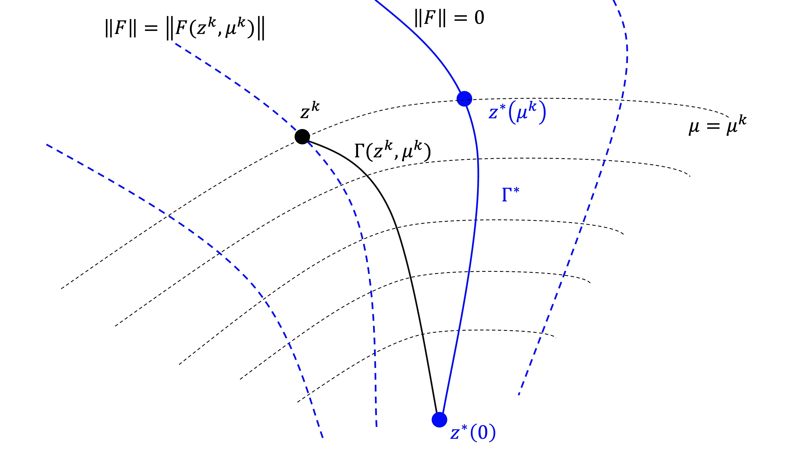
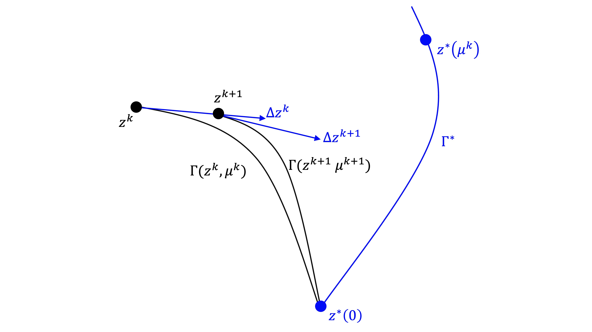
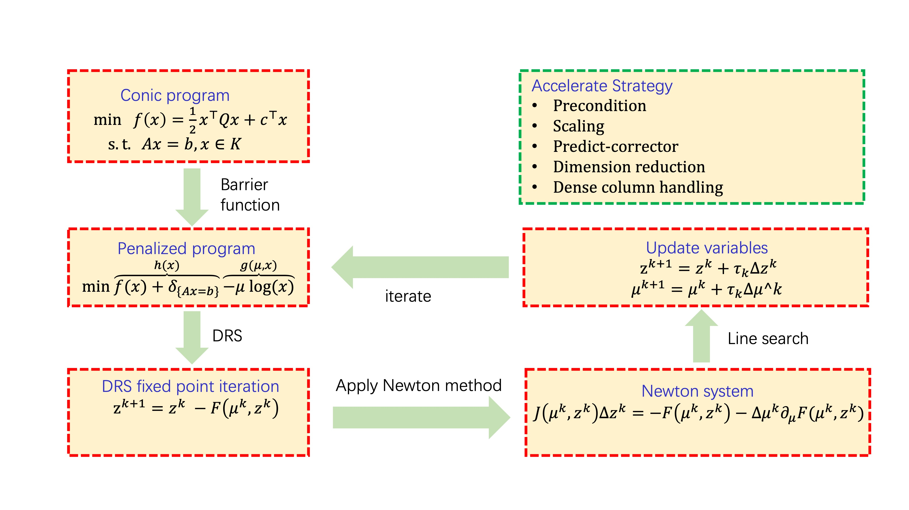

# DRSIP: An operator splitting based interior-point method for conic linear programming

This repository contains the implementation of the DRSIP algorithm for solving conic linear programming problems.

$\min_{x}  \quad \langle c, x\rangle \quad
\text{s.t.}  \quad \mathcal{A} x = b, \quad
             \quad x \in \mathcal{K} $

where $\mathcal{K} = \mathcal{K}_1 \times \mathcal{K}_2 \times \cdots \times \mathcal{K}_p$, $\mathcal{K}_i$
irrducible closed convex cone in $\mathbb{R}^{n_i}$. Some common cones supported in this package includes

* Positive orthant $\mathbb{R}_+^n = \{x \in \mathbb{R}^n | x_i \geq 0, i = 1, 2, \cdots, n\}$,
* Positive semidefinite matrices (comming soon!)
$\mathbb{S}_+^r = \{X \in \mathbb{S}^{r} \mid X \succeq 0 \}$ ,
* Second order cone
$\mathcal{Q} = \{(x_0, \bar{x}) \in \mathbb{R}^r \mid x_0 \geq \|\bar{x}\|_2\}$,
* Rotated second order cone
$\mathcal{Q}^r = \{(x_0, x_1 \bar{x}) \in \mathbb{R}^r \mid 2 x_0 x_1 \geq \|\bar{x}\|_2^2, x_0, x_1 \geq 0\}$

### Algorithm 

DRSIP algorithm is based on the operator splitting technique. The algorithm transforms the penalized problem 
$$
\min \overbrace{\langle c, x\rangle + \delta_{\{Ax=b\}}}^{h(x)} + \mu g(x)
$$
into an equivalent DRS residual mapping
$$
 F(z, \mu) = \mathrm{prox}_{\gamma \mu g}(z) - \mathrm{prox}_{\gamma h}( 2\mathrm{prox}_{\gamma \mu g}(z) - z).
$$
Then apply a Newton-type method with path-following strategy to solve the DRS residual mapping. The following figure shows the solution path and iterateion scheme of the DRSIP algorithm. 

<div align="center">
    
    
</div>

The main loop of the DRSIP algorithm is shown as follows:


Refer to the reference for more details.

### Demo

```matlab    
%% socp + lp
%% min <c_q, x_q> + <c_l, x_l>
% st    x_q : second order cone variable
%       x_l >= 0
%       A_q * x_q + A_l * x_l == b

startup;
rand('seed',1); 
m = 30; n_q = 50; n_l = 40; n = n_q + n_l;

x_q0 = rand(n_q ,1);
x_q0(1) = norm(x_q0); % ensure abs(x0(1)) >= norm(x(2:end));
A_q = rand(m, n_q);
c_q = rand(n_q, 1);
c_q(1) = norm(c_q); % ensure the problem is bounded
b_q = A_q * x_q0;

x_l0 = rand(n_l ,1);
A_l = rand(m, n_l);
c_l = rand(n_l, 1);
b_l = A_l * x_l0;

model.At = MatCell({A_q', A_l'});
model.c = MatCell({c_q, c_l});
model.b = b_q + b_l;
model.K = Cone({BasicCone('q', n_q), BasicCone('l', n_l)});
model.name = "random QLP" ;
params = struct;
out  = drsip(model, params);
```


